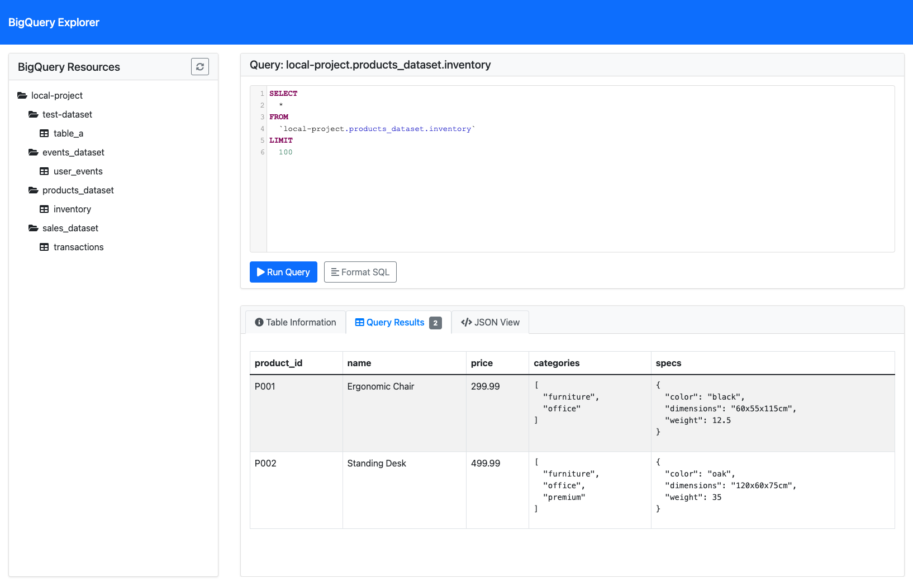

# BigQuery Emulator UI

A web UI for Google BigQuery Emulator, providing a simple interface to interact with local BigQuery emulator instances.

## Purpose

This project serves as a user-friendly web interface for the BigQuery emulator, allowing developers to:
- Browse emulated BigQuery resources
- Execute and test queries in a local development environment
- Validate schemas and data without connecting to production BigQuery
- Accelerate development and testing workflows

## Features

- Connect to BigQuery emulator or real BigQuery service
- Browse projects, datasets, and tables
- View table schemas
- Execute queries and get results
- Simple, responsive web interface

## Installation

### Prerequisites

- Go 1.23+
- Docker and Docker Compose (for containerized setup)

### Local Installation

1. Clone this repository:
   ```bash
   git clone https://github.com/filipecaixeta/bigquery-emulator-ui.git
   cd bigquery-emulator-ui
   ```

2. Install dependencies:
   ```bash
   go mod download
   ```

3. Create a `.env` file to override defaults (optional):
   ```
   BIGQUERY_PROJECT_ID=your-project-id
   BIGQUERY_EMULATOR_HOST=localhost:9050
   PORT=8000
   ```

4. Build the application:
   ```bash
   go build -o bigquery-emulator-ui .
   ```

## Running the Application

### Local Execution

Run the server with command-line flags:

```bash
./bigquery-emulator-ui --project=your-project-id --emulator=localhost:9050
```

Or use environment variables:

```bash
BIGQUERY_PROJECT_ID=your-project-id BIGQUERY_EMULATOR_HOST=localhost:9050 ./bigquery-emulator-ui
```

By default, the UI server runs on port 8000. Access it at http://localhost:8000

### Docker Execution

If you already have a BigQuery emulator running, you can use this UI with it:

1. Create a minimal `docker-compose.yaml`:
   ```yaml
    version: '3.7'
    services:
        bigquery:
            platform: linux/x86_64
            image: ghcr.io/goccy/bigquery-emulator:latest
            volumes:
                - ./data:/data
            command: --project=local-project --data-from-yaml=/data/data.yaml
        bq-ui:
            image: ghcr.io/filipecaixeta/bigquery-emulator-ui:latest
            ports:
                - "8000:8000"
            environment:
                - BIGQUERY_PROJECT_ID=local-project
                - BIGQUERY_EMULATOR_HOST=bigquery:9050
            depends_on:
                - bigquery
   ```

2. Start the UI container:
   ```bash
   docker-compose up -d
   ```

Access the UI at http://localhost:8000

#### Environment Variables for Docker

You can customize the Docker environment by modifying the docker-compose.yaml file or by creating a .env file with the following variables:

- `BIGQUERY_PROJECT_ID`: The BigQuery project ID
- `BIGQUERY_EMULATOR_HOST`: The BigQuery emulator host and port (default: "localhost:9050")
- `PORT`: The port for the UI server (default: 8000)

## Development

To run in development mode with hot reloading:

```bash
go run . --project=your-project-id --emulator=localhost:9050
```

## CI/CD Pipeline

This project uses GitHub Actions to automatically build and publish Docker images to GitHub Container Registry.

- Images are built on every push to main/master branch and for pull requests
- When pushing tags (v1.0.0, etc.), versioned images are created
- Latest images are available at `ghcr.io/filipecaixeta/bigquery-emulator-ui:latest`
- Versioned images follow semantic versioning: `ghcr.io/filipecaixeta/bigquery-emulator-ui:v1.0.0`


## Troubleshooting

- **Connection issues**: Ensure the BigQuery emulator is running and accessible
- **Authentication errors**: When using real BigQuery, check your GCP credentials
- **Empty projects list**: Verify the project ID matches what's configured in the emulator

## UI Preview


